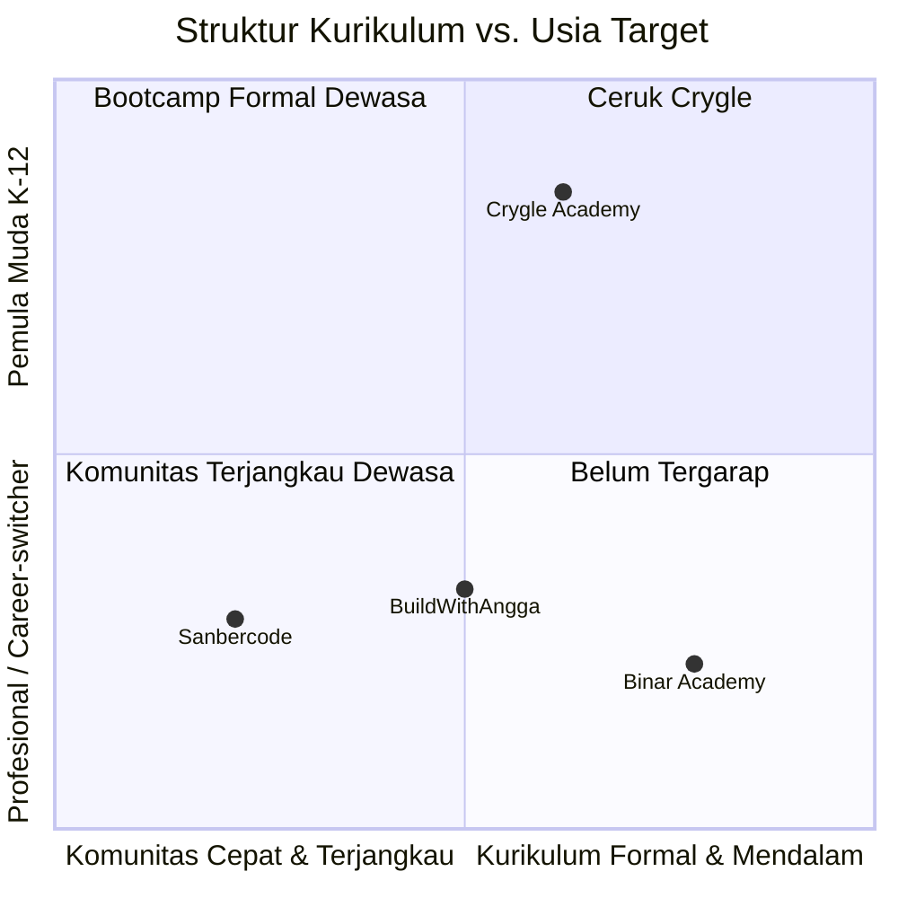
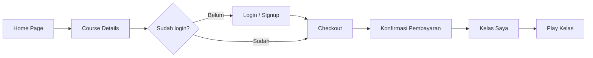
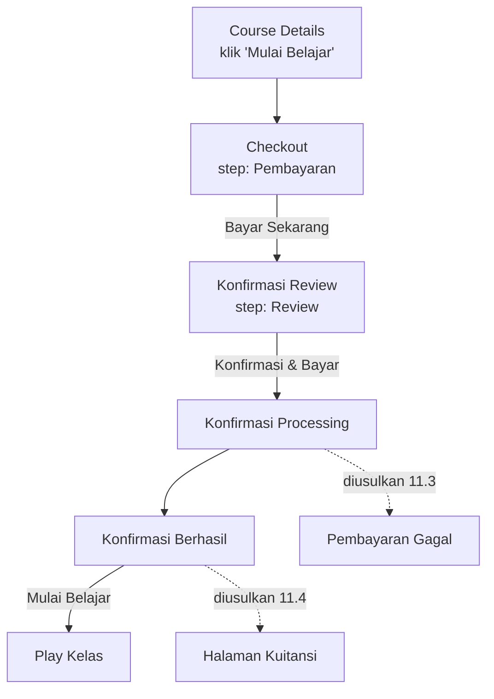
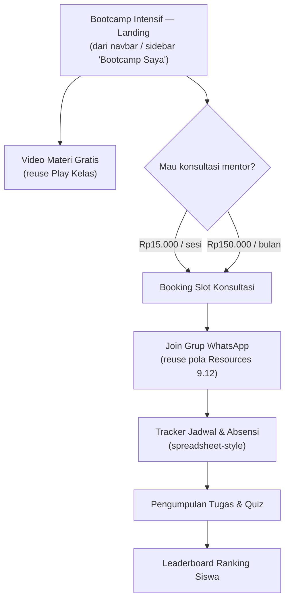

# Crygle Academy — Product Requirements Document

**Versi:** 2.2 (Markdown handoff edition + Design System resmi) · **Tanggal:** 3 September 2026 · **Status:** Draft — siap untuk handoff development & design
**Sumber desain:** Figma — [Research Web Academy (Copy)](https://www.figma.com/design/ueGJd0omZ8gQNmGvAaz9G2/Research-Web-Academy--Copy-?node-id=735-1568), page **Prototype**

---

## 0. Cara Membaca Dokumen Ini (untuk AI Agent & Tim)

Dokumen ini menggabungkan tiga jenis informasi dengan tingkat kepastian berbeda. Setiap bagian/baris ditandai salah satu label berikut — **jangan perlakukan semuanya sebagai fakta yang sudah final**:

| Label | Arti | Boleh langsung dieksekusi? |
|---|---|---|
| ✅ **DESAINED** | Sudah ada layar final di Figma, dengan node ID yang bisa dibuka langsung | Ya — build sesuai desain, tapi cross-check node ID di Figma sebelum mulai |
| 🆕 **DIUSULKAN** | Belum ada di Figma. Konsep & struktur konten sudah disusun di dokumen ini, memakai ulang komponen yang sudah ada | Bisa masuk sprint desain (bikin mockup Figma dulu) sebelum development, **jangan langsung coding tanpa mockup** |
| 💭 **IDEATION** | Spekulatif, belum divalidasi bisnis/user | Jangan dieksekusi — perlu diskusi & validasi dulu |
| ⚠️ **KEPUTUSAN DIPERLUKAN** | Ada pertanyaan terbuka yang butuh jawaban manusia (bisnis/legal/konten) sebelum desain/dev lanjut | Blocker — eskalasi ke product owner |

Semua link node Figma memakai format `node-id=X-Y` (titik dua di ID asli Figma `X:Y` diganti strip `-` untuk URL).

---

## 1. Ringkasan Eksekutif

Crygle Academy adalah platform belajar kreatif digital — desain, coding, dan robotika — untuk pelajar SD hingga SMK, dijalankan sebagai kolaborasi **"Crygle Academy x Boarding School"**. Penelusuran penuh terhadap file Figma page **Prototype** menemukan **11 layar desktop (1440px)** ✅ **DESAINED** yang membentuk empat alur inti: Marketing & Discovery, Autentikasi, Commerce (checkout), dan Learning Experience.

Riset lanjutan terhadap dokumen kerja internal tim (audit kurikulum, outline modul, catatan perencanaan) dan benchmark tiga kompetitor riil (Binar Academy, BuildWithAngga, Sanbercode) menghasilkan **18 alur/layar tambahan** 🆕 **DIUSULKAN** untuk menutup gap yang teridentifikasi, plus strategi brand dan satu arah ekspansi B2B 💭 **IDEATION** yang belum divalidasi.

**Statistik cepat:**
- 11 layar ✅ desained
- 18 solusi alur/layar 🆕 diusulkan (§10–§11)
- 3 kompetitor riil dibenchmark: Binar Academy, BuildWithAngga, Sanbercode (§5)
- 6 gap berdampak High/Critical yang masih perlu keputusan (§14)

---

## 2. Latar Belakang & Konteks Riset

Empat dokumen kerja di luar file Figma mengonfirmasi &amp; memperdalam konteks produk:

| Dokumen | Yang dikonfirmasi |
|---|---|
| Screenshot catatan Figma (dikirim user) | Menegaskan ulang isi catatan lepas kanvas Figma — Bootcamp gratis + konsultasi berbayar (referensi eksplisit **"Sanbercode"**), skema Rp15.000/konsultasi atau Rp150.000/bulan, dan wishlist grup WA + spreadsheet + tugas/quiz + leaderboard. Lihat §10. |
| `Outline Lanjutan Section 1 - Apa Itu UI dan UX Design.md` &amp; `Outline Sejarah UI-UX Design - Point 2.md` | Header modul berbunyi **"Crygle Academy x Boarding School"** — produk ini kolaborasi dengan sekolah asrama, bukan marketplace kursus umum. Disusun untuk melanjutkan pekerjaan **Dimas Pradipa Abiyuda, S.Tr.Kom.** — nama yang sama persis dengan mentor di layar Course Details. Mentor ini **orang nyata**, bukan persona rekaan desainer. |
| `Audit Relevansi Materi UI-UX Binar Academy untuk Crygle Academy.docx` (Juli 2026) | Kurikulum flagship Crygle dibangun di atas 49 dek kanonis **Binar Academy** (2021–2022) yang baru diaudit. Detail &amp; rekomendasi lengkap di §12. |
| Riset kompetitor (web, September 2026) | Pola diskon agresif + kode promo di layar Checkout meniru **BuildWithAngga** — file Figma bahkan masih menyisakan placeholder trailer video bernama `"BWA Class"` yang belum diganti. Detail di §5. |

**Catatan tambahan:**
- Nama file Figma ("Research Web Academy") tidak sama dengan brand yang tampil di seluruh layar ("Crygle Academy") — kemungkinan file riset/eksplorasi awal yang belum di-*rename*. File yang sama juga punya page `/Design-System` (node `467:326`) di luar `/Prototype` — sumber token resmi di §13.
- Model bisnis tersirat: kelas berbayar dengan diskon agresif (termasuk skema "100% off" sebagai funnel akuisisi untuk kelas basic), harga dalam Rupiah, dan *registration fee* terpisah dari harga kelas di checkout.
- ✅ **Dikonfirmasi Design System resmi (§5.1):** model bisnisnya adalah *"free entry classes, paid 'LEVEL UP' classes, on-demand mentors, lifetime access, and a certificate once a course average of 80 is met."* — **"LEVEL UP"** adalah nama resmi tier berbayar (bukan istilah PRD ini), dan syarat sertifikat adalah **nilai rata-rata kelas ≥ 80**, bukan sekadar "selesai 100% modul" seperti asumsi awal di §9.11/§9.12.

---

## 3. Tujuan Produk &amp; Metrik Keberhasilan

**Tujuan:**
1. Mengonversi pengunjung landing page menjadi akun terdaftar (Daftar / Masuk).
2. Memberi calon siswa informasi cukup untuk memutuskan membeli kelas — kurikulum, profil mentor, durasi, level.
3. Menyediakan alur checkout &amp; pembayaran multi-metode (kartu, virtual account, QRIS) yang jelas tahapannya.
4. Memberikan pengalaman belajar terstruktur pasca-pembelian: progres per modul, video player, materi unduhan, akses komunitas.

**Metrik keberhasilan (🆕 usulan tim produk — tidak ada metrik eksplisit di desain):**

| Metrik | Diukur di antara | Kenapa penting |
|---|---|---|
| Conversion ke pendaftaran | Home Page → Signup selesai | Validasi efektivitas landing page &amp; CTA |
| Checkout completion rate | Checkout dibuka → Pembayaran Berhasil | Deteksi drop-off di 3-step stepper |
| Drop-off per metode bayar | Pilih metode → Bayar Sekarang | 5 metode bayar bersaing kompleksitas vs. konversi |
| Course completion rate | Progress Belajar 0% → 100% | Indikator utama nilai produk untuk siswa &amp; orang tua |
| Okupansi konsultasi Bootcamp | Slot jadwal dibuka → dibooking (§10) | Validasi model bisnis konsultasi berbayar mentor |

---

## 4. Target Pengguna &amp; Persona

FAQ pada Home Page: *"CRYGLE Academy dirancang khusus untuk pemula dari tingkat SD hingga SMK."* Kemungkinan besar disalurkan lewat kemitraan sekolah asrama (§2), bukan pasar umum.

| Persona | Peran | Kebutuhan |
|---|---|---|
| **Pelajar SD–SMK** (utama) | Boarding school, minim/tanpa pengalaman desain/coding/robotika | Materi bertahap, jadwal terstruktur (cocok ritme asrama), sertifikat, akses seumur hidup |
| **Orang Tua / Wali** (sekunder) | Pengambil keputusan pembelian | Transparansi harga/diskon, sertifikat resmi, trust badge ("Akses Selamanya", "Grup Komunitas") |
| **Mentor / Pengajar** (sisi supply) | Berbasis orang nyata, mis. Dimas Pradipa Abiyuda, S.Tr.Kom. | Halaman profil ("Tentang Mentor"), jalur chat langsung dengan siswa |
| **Admin Sekolah Mitra** 💭 IDEATION | Belum ada di desain manapun | Lihat §15 — tersirat dari branding "x Boarding School" |

---

## 5. Strategi Brand &amp; Positioning ✅ DESAIN SYSTEM RESMI DITEMUKAN

> **Update penting (v2.2):** ternyata sudah ada **Design System resmi** yang dibangun tim lewat Claude Design — [CRYGLE Academy Design System ↗](https://claude.ai/design/p/d21a7fbc-41df-41a5-9ad8-4fa47db01baf) — hasil ekstraksi penuh dari dua page Figma: `/Design-System` (node `467:326`, papan Colors/Typography/Buttons) dan `/Prototype` (node `735:1568`, 20 frame produk). Dokumen itu sudah membangun token warna/tipografi/spacing lengkap plus 58 komponen siap pakai (Button, CourseCard, Accordion, NavBar, Footer, dst.) dan satu **click-through prototype** (Home → Course Details → Login). Bagian §5 &amp; §13 di bawah ini sudah disinkronkan dengan token resminya — bukan lagi rekonstruksi spekulatif seperti versi v2.0/v2.1 sebelumnya.

### 5.1 Sinyal brand terkonfirmasi (✅ dari Design System resmi)
- **Logo** — satu SVG mark per tone: `book-mark-blue.svg` (buku biru, nib putih, untuk latar terang) dan `book-mark-white.svg` (buku putih, nib biru, untuk latar biru). Mark = siluet mingcute `book-6-fill` dengan tepi halaman kuning + emblem nib pena — nib-nya konsisten dengan ikon `Huge-icon/education/outline/fountain pen` yang dipakai di seluruh produk. Ukuran: 48px di header/footer, 55px di layar auth.
- **Motif "Sanctuary"** — muncul independen di dua titik copy checkout: *"…transaksi kamu berjalan aman di Sanctuary kami"* (Konfirmasi–Processing) dan *"…dimulai sekarang di sanctuary digital kami"* (Konfirmasi–Berhasil). Design System resmi belum mengangkat ini jadi pilar voice terdokumentasi — masih peluang terbuka untuk diformalkan.
- **Model bisnis terkonfirmasi tertulis eksplisit** di Readme design system: *"free entry classes, paid 'LEVEL UP' classes, on-demand mentors, lifetime access, and a certificate once a course average of 80 is met."* — **"LEVEL UP"** adalah nama resmi tier berbayar, dan syarat sertifikat adalah **nilai rata-rata kelas ≥ 80** (detail konkret yang sebelumnya tidak ada di §3/§9).
- **Voice &amp; content rules** (dari Readme, ditranskrip verbatim dari copy produk):
  - **Bahasa** — Indonesia sepanjang produk, istilah produk/industri tetap Inggris ("Explore Kelas", "Kelas Populer", "Lifetime Access/Akses Seumur Hidup") — jangan diterjemahkan ke arah manapun.
  - **Sudut pandang** — orang kedua tunggal informal **"kamu"**, tidak pernah "Anda" di copy UI. "Anda" hanya muncul di prosa deskripsi kelas panjang (ditulis sebagai marketing body copy, bukan teks interface). Orang pertama jamak: **"kami"**.
  - **Register** — hangat, lugas, tidak canggung membahas mulai dari nol. Menjawab kecemasan pembaca secara langsung: *"Saya belum pernah belajar coding, robotik dan desain, apakah bisa ikut?"* → *"Tentu bisa! Justru CRYGLE Academy dibuat untuk membantu kamu yang masih bingung harus mulai dari mana."*
  - **Casing** — Title Case untuk heading &amp; CTA ("Lihat Lainnya", "Mulai Belajar"); ALL CAPS hanya untuk heading kolom footer (NAVIGASI, PROGRAM, DUKUNGAN) &amp; eyebrow kategori kecil (KATEGORI KELAS); sentence case untuk label form ("Alamat Email").
  - **Angka &amp; harga** — Rupiah dengan titik pemisah ribuan; dua ejaan hidup berdampingan di file: `Rp. 449.000` di course card, `Rp449.000` di checkout — ikuti konvensi surface yang sedang dikerjakan.
  - **Emoji** — hemat, hanya sebagai tanda baca ("Halo, Selamat Datang 👋" di login, 🎨🤖💻 di satu jawaban FAQ). Tidak pernah di heading, tombol, nav, atau body copy marketing.
  - **Larangan** — tidak ada tumpukan tanda seru, tidak ada urgency ala growth-marketing ("kuota terbatas"), tidak ada jargon yang belum dikenal audiens.

### 5.2 Pilar voice yang diusulkan 🆕 (interpretasi PRD ini di atas fakta §5.1 — belum ada di Design System resmi)

| # | Pilar | Deskripsi |
|---|---|---|
| 1 | **Sanctuary, bukan sekadar sekolah** | Ruang belajar yang terasa aman untuk mencoba &amp; gagal. Pakai kata "aman", "terlindungi", "sanctuary" secara sadar di momen rawan cemas (bayar, submit tugas, mulai kelas baru). |
| 2 | **Membimbing, bukan menggurui** | Sapaan "kamu", pertanyaan retoris pembuka tiap topik, analogi dari dunia anak muda — bukan bahasa akademik kaku. |
| 3 | **Jujur soal sumber** | Diwarisi dari kebiasaan penyusun kurikulum yang eksplisit memisahkan "fakta terverifikasi" dari "analogi populer" (§12). Nilai unik yang jarang dimiliki kompetitor — layak diangkat ke UI (mis. badge "terverifikasi" di materi). |
| 4 | **Belajar sampai hasilnya nyata** | Course flagship: "Menghasilkan Dolar Hanya Dengan Menjual Produk UI Kit" — bukan cuma teori, tapi jalur monetisasi konkret. Tagline turunan: *"Bukan hanya teori, tapi juga aksi."* |

### 5.3 Peta positioning vs. kompetitor riil

Tiga nama berikut bukan asumsi — dua disebut eksplisit di catatan Figma tim (§2) dan satu terlihat dari pola desain checkout. Profil dirangkum dari situs resmi masing-masing (dicek September 2026, lihat §16 untuk tautan).

*Diagram — Crygle satu-satunya yang menyasar kuadran pemula K-12 dengan struktur kurikulum formal.*

| Kompetitor | Tagline posisi | Ciri khas | Relevansi ke Crygle |
|---|---|---|---|
| **Binar Academy** | Bootcamp career-switcher, sejak 2016 | Kurikulum terstruktur, job connect, multi-kota | Basis kurikulum yang diadaptasi Crygle (§12) |
| **BuildWithAngga** | Skill individual, promo agresif | Diskon besar + kode promo (mis. 2,5jt→88rb), forum privat | ✅ **Terkonfirmasi hard evidence** — Design System resmi mencatat file Figma secara literal meng-*import* library komponen dari `buildwithangga.com` sebagai salah satu sumbernya (bukan cuma dugaan dari pola visual lagi) |
| **Sanbercode** | Bootcamp online murah, cohort mingguan | Mulai ~Rp219rb, batch 4 minggu, grup diskusi + live session + quiz + final project | Cetak biru untuk alur Bootcamp Intensif (§10) |
| **easy-course-buy.lovable.app** | Template checkout kelas (dibangun di Lovable) | Referensi teknis, bukan brand kompetitor | ✅ **Baru ditemukan** — library kedua yang di-*import* langsung ke file Figma menurut Design System resmi; kemungkinan sumber pola UI Checkout §9.5 |
| **Crygle Academy** | Sanctuary belajar untuk K-12 | Satu-satunya yang menyasar SD–SMK secara formal, terintegrasi ke sekolah asrama | — |

> **Sumber:** profil Binar Academy &amp; Sanbercode dari riset web (September 2026, tautan di §16). Baris BuildWithAngga &amp; easy-course-buy.lovable.app dikonfirmasi langsung dari isi Readme [CRYGLE Academy Design System ↗](https://claude.ai/design/p/d21a7fbc-41df-41a5-9ad8-4fa47db01baf) — bukan inferensi.

### 5.4 Pertanyaan terbuka dari Design System resmi ⚠️

Pembangun Design System (sesi Claude Design sebelumnya) meninggalkan pekerjaan dalam kondisi **terinterupsi** dengan satu pertanyaan yang belum terjawab siapa pun di tim — dokumen ini mewariskannya sebagai keputusan terbuka:

> *"Whether the Roboto scattered through the Prototype frames is intentional or unfinished."*
> Papan fondasi (`/Design-System`) menetapkan **SF UI Text** sebagai satu-satunya typeface produk (13 langkah skala, weight 400/500/600/700 saja). Tapi beberapa frame di `/Prototype` — heading layar Login, breadcrumb, teks "Apa yang Akan Kamu Dapat?" — masih memakai **Roboto**. Kemungkinan besar belum sempat dirapikan, tapi ini **butuh konfirmasi manusia**, bukan asumsi AI agent, sebelum token tipografi di-hardcode ke kode produksi.

Dua item tambahan yang masih menunggu dari tim (dicatat Design System, belum terselesaikan saat dokumen ini ditulis):
- Font binary **SF Pro Display** &amp; **Plus Jakarta Sans** belum di-upload (dipakai di label tombol foundations &amp; beberapa CTA produk) — saat ini fallback ke SF UI Text.
- Font **Pixellari** yang direferensikan ilustrasi login juga belum ada binary-nya.

---

## 6. Lingkup Dokumen

| Dalam lingkup | Di luar lingkup |
|---|---|
| Spesifikasi 11 layar yang sudah didesain (§9), usulan alur/layar penutup gap (§10–§11), strategi brand (§5), risiko konten kurikulum (§12) | Arsitektur teknis (API, database, infra), desain visual pixel-perfect untuk usulan §10–§11 &amp; §15 (masih level konsep/wireframe verbal), keputusan bisnis final (harga institusi, kontrak sekolah mitra) |

---

## 7. Peta Informasi (Sitemap) — 11 Layar ✅ DESAINED

| # | Layar | Kategori | Ukuran | Node Figma |
|---|---|---|---|---|
| 01 | Home Page | Marketing | 1440×6963 | [`735:1569`](https://www.figma.com/design/ueGJd0omZ8gQNmGvAaz9G2/Research-Web-Academy--Copy-?node-id=735-1569) |
| 02 | Course Details — Overview | Discovery | 1440×3365 | [`735:3064`](https://www.figma.com/design/ueGJd0omZ8gQNmGvAaz9G2/Research-Web-Academy--Copy-?node-id=735-3064) |
| 03 | Course Details — Kurikulum Kelas | Discovery | 1440×3393 | [`735:3336`](https://www.figma.com/design/ueGJd0omZ8gQNmGvAaz9G2/Research-Web-Academy--Copy-?node-id=735-3336) |
| 04 | Course Details — Tentang Mentor | Discovery | 1440×2938 | [`735:3648`](https://www.figma.com/design/ueGJd0omZ8gQNmGvAaz9G2/Research-Web-Academy--Copy-?node-id=735-3648) |
| 05 | Checkout | Commerce | 1440×1657 | [`735:3922`](https://www.figma.com/design/ueGJd0omZ8gQNmGvAaz9G2/Research-Web-Academy--Copy-?node-id=735-3922) |
| 06 | Konfirmasi — Review | Commerce | 1440×1259 | [`735:4126`](https://www.figma.com/design/ueGJd0omZ8gQNmGvAaz9G2/Research-Web-Academy--Copy-?node-id=735-4126) |
| 07 | Konfirmasi — Processing | Commerce | 1440×1395 | [`735:4234`](https://www.figma.com/design/ueGJd0omZ8gQNmGvAaz9G2/Research-Web-Academy--Copy-?node-id=735-4234) |
| 08 | Konfirmasi — Berhasil | Commerce | 1440×1690 | [`735:4333`](https://www.figma.com/design/ueGJd0omZ8gQNmGvAaz9G2/Research-Web-Academy--Copy-?node-id=735-4333) |
| 09 | 01 Login | Auth | 1440×1024 | [`735:4450`](https://www.figma.com/design/ueGJd0omZ8gQNmGvAaz9G2/Research-Web-Academy--Copy-?node-id=735-4450) |
| 10 | 02 Signup | Auth | 1440×1024 | [`735:5405`](https://www.figma.com/design/ueGJd0omZ8gQNmGvAaz9G2/Research-Web-Academy--Copy-?node-id=735-5405) |
| 11 | Kelas Saya (Dashboard) | Learning | 1440×1024 | [`814:5929`](https://www.figma.com/design/ueGJd0omZ8gQNmGvAaz9G2/Research-Web-Academy--Copy-?node-id=814-5929) |
| 12 | Play Kelas | Learning | 1440×1024 | [`855:684`](https://www.figma.com/design/ueGJd0omZ8gQNmGvAaz9G2/Research-Web-Academy--Copy-?node-id=855-684) |

> ⚠️ **Catatan:** frame duplikat "01 Login" ditemukan di node `1041:517` dengan konten identik — kemungkinan sisa iterasi desain, bersihkan sebelum development dimulai.

---

## 8. Alur Pengguna Utama (✅ dari 11 layar terdesain)

*Diagram 1 — Alur level-tinggi menghubungkan 4 kelompok layar.*

### 8.1 Marketing → Discovery
Home Page (§9.1) menampilkan 9 section landing, termasuk grid 6 kelas populer. Pengguna masuk ke Course Details lewat: tombol hero **"Explore Kelas"**, klik kartu kelas, atau tombol **"Lihat Lainnya"** (tujuan 🆕 diusulkan §11.2). Tab-bar Course Details — **Overview / Kurikulum Kelas / Tentang Mentor / Reviews** — berbagi header &amp; sidebar harga; tab Reviews 🆕 diusulkan §11.1.

### 8.2 Autentikasi
Dipicu dari navbar ("Masuk"/"Daftar") atau step pertama stepper Checkout. Signup: Full Name, Email, Password, Konfirmasi Password, centang T&amp;C, opsi "Continue with Google". Login: Email, Password, checkbox "Ingatkan Saya", link "Lupa Password?" (🆕 diusulkan §11.10). Verifikasi email/OTP 🆕 diusulkan §11.11.

### 8.3 Commerce — Discovery → Belajar

*Diagram 2 — Alur checkout 3-step; garis putus-putus = usulan baru (§11).*

Stepper **Login → Pembayaran → Review** tampil identik di Checkout dan ketiga layar Konfirmasi. Checkout menawarkan 5 metode bayar plus Kode Promo (pola BuildWithAngga, §5) dan Rincian Harga. ⚠️ **Tidak ada state gagal bayar yang didesain** — solusi diusulkan §11.3, prioritas Critical (§14).

### 8.4 Learning Experience
Dashboard "Kelas Saya" punya sidebar 7 menu, hanya "Course Saya" yang punya layar isi — 6 lainnya 🆕 diusulkan §11.6. Klik course card → Play Kelas: sidebar accordion modul/lesson, video player custom, kartu mentor + CTA "Chat Mentor Terkait" (🆕 diusulkan §11.7), tab Resources/Ringkasan/Review — hanya Resources berisi konten (unduhan aset + link Grup WhatsApp, pola dipakai ulang di Bootcamp Intensif §10).

---

## 9. Spesifikasi Fungsional per Layar ✅ DESAINED

### 9.1 Home Page
`735:1569` · Marketing · 1440×6963

**Tujuan:** Landing page konversi — memperkenalkan brand, program, kelas populer, bukti sosial, mendorong pendaftaran/eksplorasi kelas.

**Elemen kunci:**
- Navbar sticky: logo, Beranda, Video Kelas ▾, Bootcamp Intensif ▾, Mentor, Tentang, Masuk, Daftar
- Hero dengan video trailer + rating sosial (4.5, 300+ reviews)
- Rangkaian Program (Design / Coding / Robot) — 3 kartu + kartu "Tentang Kami"
- Grid 6 kartu Kelas Populer + tombol "Lihat Lainnya"
- Hasil Karya Alumni, Testimoni, FAQ, CTA akhir, Footer 4 kolom

**Interaksi &amp; navigasi:**
- "Explore Kelas", kartu kelas, "Lihat Lainnya" → Course Details
- "Masuk" → 01 Login · "Daftar" → 02 Signup
- FAQ item → expand/collapse in-page

**Catatan:** Dropdown navbar 🆕 diusulkan §11.5. Kartu program "Kreatif Design" tampil dalam state highlight sementara dua lainnya outline — ⚠️ perlu diklarifikasi apakah default state atau active state.

---

### 9.2–9.4 Course Details — Overview · Kurikulum Kelas · Tentang Mentor
`735:3064` / `735:3336` / `735:3648` · Discovery · ~1440×3000–3400

**Tujuan:** Memberi informasi cukup agar calon siswa yakin membeli. Ketiga tab berbagi header (breadcrumb, judul, trailer YouTube, rating) dan sidebar sticky (harga, benefit, "Mulai Belajar").

**Elemen kunci per tab:**
- **Overview** — deskripsi + "Apa yang Akan Kamu Dapat?"
- **Kurikulum Kelas** — accordion 8 chapter (⚠️ lihat §12 untuk risiko konten sebelum di-populate)
- **Tentang Mentor** — profil Dimas Pradipa Abiyuda (nyata, §2), rating, total siswa/course
- Sidebar harga Rp449.000 (coret Rp899.000, 50% off, pola BWA §5), 5 benefit, tombol "Mulai Belajar"

**Interaksi &amp; navigasi:**
- Tab-bar → ganti konten in-page (Reviews 🆕 diusulkan §11.1)
- "Mulai Belajar" → Checkout (atau Login dulu jika belum login)
- Kartu "Course Serupa" → Course Details kelas lain

**Catatan:** ⚠️ Konten "Kurikulum Kelas" yang tampil (chapter UI/UX) berasal dari materi yang sedang diaudit ulang — lihat §12 sebelum konten final dipasang ke layar ini.

---

### 9.5 Checkout
`735:3922` · Commerce · 1440×1657

**Tujuan:** Pengguna memilih metode pembayaran &amp; menerapkan promo sebelum lanjut ke review pesanan.

**Elemen kunci:**
- Step indicator: Login (selesai) → Pembayaran (aktif) → Review
- Metode bayar: Debit/Credit Card, BNI VA, Mandiri VA, BSI VA, QRIS
- Panel "Pesanan Saya" + "Kode Promo" + "Rincian Harga" (Invest Ilmu + Registration Fee = Total Invest)

**Interaksi &amp; navigasi:**
- Pilih metode bayar → form berubah sesuai metode (radio group)
- "Bayar Sekarang" → Konfirmasi — Review

**Catatan:** Label layer beberapa opsi bayar tidak sinkron dengan teks tampil di file Figma (mis. layer bernama "Google Pay" berisi teks "BNI Virtual Account") — rapikan sebelum handoff dev, lihat §13.

---

### 9.6–9.8 Konfirmasi — Review · Processing · Berhasil
`735:4126` / `735:4234` / `735:4333` · Commerce · ~1440×1250–1700

**Tujuan:** Tiga state berurutan dari satu proses pembayaran: konfirmasi akhir, status diproses, lalu hasil.

**Elemen kunci:**
- **Review** — ringkasan Atas Nama, Course, Mentor, Metode Bayar, Total Invest
- **Processing** — spinner animasi, teks "Memproses pembayaran kamu… aman di Sanctuary kami" (§5.1), Merchant, Order ID, Total, catatan keamanan
- **Berhasil** — icon check, "Pembayaran Berhasil! 🎉 …sanctuary digital kami" (§5.1), kartu kelas + Progress Belajar 0%, 3 trust badge

**Interaksi &amp; navigasi:**
- Review: "Konfirmasi &amp; Bayar" → Processing → otomatis lanjut ke Berhasil (⚠️ tanpa durasi/timeout eksplisit di desain — klarifikasi ke engineering)
- Berhasil: "Mulai Belajar" → Play Kelas · "Lihat Kuitansi" → 🆕 diusulkan §11.4

**Catatan kritikal:** ⚠️ **Tidak ada state "Pembayaran Gagal"** yang didesain. Untuk metode VA/QRIS dengan risiko gagal/kedaluwarsa tinggi, ini **blocker** sebelum development — solusi diusulkan §11.3.

---

### 9.9–9.10 01 Login &amp; 02 Signup
`735:4450` / `735:5405` · Auth · 1440×1024

**Tujuan:** Split-screen — ilustrasi brand (Design/Robotic/Coding) di kiri, form di kanan, konsisten di kedua layar.

**Elemen kunci:**
- **Login** — Email, Password, checkbox "Ingatkan Saya", link "Lupa Password?", tombol "Masuk", "Lanjutkan dengan Google"
- **Signup** — Full Name, Email, Password, Konfirmasi Password, checkbox T&amp;C, tombol "Buat Akun", "Continue with Google"

**Interaksi &amp; navigasi:**
- Login/Signup sukses → Kelas Saya (asumsi auto-login pasca-signup)
- Teks silang "Buat Akun" / "Masuk" menghubungkan kedua form

**Catatan:** Frame Login terduplikasi (`735:4450` &amp; `1041:517`) dengan konten identik — housekeeping. Verifikasi email/OTP (§11.11) &amp; tujuan "Lupa Password?" (§11.10) 🆕 diusulkan.

---

### 9.11 Kelas Saya (Dashboard)
`814:5929` · Learning · 1440×1024

**Tujuan:** Hub pasca-login — siswa melihat &amp; melanjutkan kelas yang sudah dibeli.

**Elemen kunci:**
- Sidebar 7 menu: Overview, Course Saya (aktif), Bootcamp Saya, Explore Kelas, Chat Mentor, Affiliate, Setting
- Header: search "Course Name/Mentor", filter Level, Category, Sort By
- Grid kartu kelas dengan progress bar per kelas (mis. 5/8 Modul — 60%)

**Interaksi &amp; navigasi:**
- Klik kartu kelas → Play Kelas
- 6 menu sidebar lain → 🆕 diusulkan §11.6, "Bootcamp Saya" → §10

**Catatan:** 6 dari 7 menu sidebar belum punya layar. Prioritaskan "Bootcamp Saya" &amp; "Explore Kelas" — disebut eksplisit di catatan roadmap tim (§10).

---

### 9.12 Play Kelas
`855:684` · Learning · 1440×1024

**Tujuan:** Ruang belajar aktif — menonton video modul, melacak progres, mengakses materi &amp; komunitas.

**Elemen kunci:**
- Sidebar accordion 4 modul, tiap lesson bertanda selesai (✓) + durasi
- Video player custom: play/pause, seek bar, timestamp, volume, fullscreen
- Kartu mentor + tombol "Chat Mentor Terkait"
- Tab: Resources (aktif) / Ringkasan / Review
- Resources: unduhan aset ("UI Kit Asset.fig", 12.4 MB) + link "Group Community — WhatsApp Group"

**Interaksi &amp; navigasi:**
- "Back to Dashboard" → Kelas Saya · "Next Modul" → lesson berikutnya (state in-page)
- Klik lesson di sidebar → ganti video aktif
- "Chat Mentor Terkait" → 🆕 diusulkan §11.7

**Catatan:** Tab "Ringkasan" &amp; "Review" 🆕 diusulkan §11.8–9 — belum berisi konten di desain asli. Pola "link Grup WhatsApp" dipakai ulang konsisten di alur Bootcamp Intensif (§10).

---

## 10. Alur Bootcamp Intensif 🆕 DIUSULKAN

**Sumber:** catatan tim di kanvas Figma (dikonfirmasi ulang lewat screenshot yang dikirim user). Belum ada satupun layar resmi. Model bisnis eksplisit mencontoh **Sanbercode** (§5): materi gratis + konsultasi mentor berbayar dengan jam terjadwal.

*Diagram 4 — Alur Bootcamp Intensif, dari catatan tim ke 6 layar konkret.*

| # | Layar diusulkan | Konsep | Pattern yang dipakai ulang |
|---|---|---|---|
| 10.1 | **Bootcamp Intensif — Landing** | Halaman jual: deskripsi program, video materi gratis, 2 kartu harga berdampingan (per-sesi vs. bulanan) — mirror layout sidebar harga Course Details | Sidebar harga §9.2–4 |
| 10.2 | **Booking Slot Konsultasi** | Kalender/slot picker jam tersedia mentor ("jam jam tertentu yang sudah disediakan" — catatan tim), konfirmasi sebelum lanjut Checkout | Stepper Checkout §9.5 |
| 10.3 | **Join Grup WhatsApp** | CTA sekali-klik pasca-booking, identik dengan link komunitas yang sudah ada di Play Kelas | Resources §9.12 |
| 10.4 | **Tracker Jadwal &amp; Absensi** | Tabel mirip spreadsheet: tanggal sesi, status hadir, catatan mentor — menjawab wishlist "spreadsheet isinya jadwal, nama siswa, absensi" | Progress bar Dashboard §9.11 |
| 10.5 | **Pengumpulan Tugas &amp; Quiz** | Upload file/link per minggu + quiz pilihan ganda inline, deadline countdown | Accordion modul Play Kelas §9.12 |
| 10.6 | **Leaderboard Ranking Siswa** | Papan peringkat berbasis akumulasi nilai tugas+quiz — insentif gamifikasi eksplisit diminta di catatan tim | Kartu rating §9.2 (pola angka+badge) |

> ⚠️ **Perlu diputuskan tim bisnis:** apakah Bootcamp Intensif dijual terpisah dari kelas berbayar reguler, atau sebagai add-on. Catatan tim menyebut "video materi gratis" tapi konsultasi berbayar — model freemium ini perlu disepakati sebelum §10.1–2 didesain penuh.

---

## 11. Alur Tambahan Diusulkan 🆕 DIUSULKAN

Menutup 12 gap dari analisis awal. Setiap baris memakai kembali pola komponen yang sudah ada di 11 layar terdesain (§9) — bukan komponen baru dari nol.

| # | Gap | Solusi diusulkan |
|---|---|---|
| 11.1 | Tab "Reviews" kelas | Reuse pola testimoni Home (§9.1): histogram rating 5★–1★ + daftar ulasan (avatar, rating, komentar) + filter urutkan |
| 11.2 | Katalog "Semua Kelas" | Grid kartu (reuse Kelas Populer) + sidebar filter Kategori/Level/Harga + search bar (reuse Dashboard §9.11) + pagination |
| 11.3 | State pembayaran gagal | 4th state "Konfirmasi": icon merah, alasan gagal spesifik (kartu ditolak/VA expired/QRIS timeout), CTA "Coba Metode Lain" + "Hubungi Bantuan" |
| 11.4 | Halaman "Lihat Kuitansi" | Invoice sederhana — no. order, tanggal, item, total, tombol unduh PDF — reuse info-row Konfirmasi Review |
| 11.5 | Dropdown navbar | Mega-menu ringan: "Video Kelas" → kategori populer + "Lihat Semua" (→ §11.2); "Bootcamp Intensif" → link ke §10.1 + "Bootcamp Saya" bila login |
| 11.6 | 6 menu sidebar dashboard | Overview = ringkasan gabungan progress; Explore Kelas = alias §11.2; Chat Mentor = daftar thread per mentor/kelas; Affiliate = dashboard referral (kode, klik, komisi); Setting = form profil standar |
| 11.7 | "Chat Mentor Terkait" | Buka thread spesifik ke mentor kelas terkait dari §11.6, prefill konteks modul yang sedang ditonton |
| 11.8 | Tab "Ringkasan" (Play Kelas) | Rekap key takeaway per modul — reuse pola "Apa yang Akan Kamu Dapat?" dari Course Details |
| 11.9 | Tab "Review" (Play Kelas) | Sama seperti §11.1, di-scope ke kelas berjalan + CTA "Beri Ulasan" saat progress ≥ 80% |
| 11.10 | "Lupa Password?" | Form email → layar "cek email kamu" → link reset password (pola 3 langkah standar) |
| 11.11 | Verifikasi email/OTP | Step baru antara Signup dan Dashboard — 6 digit OTP + timer kirim ulang |
| 11.12 | Tentang / Mentor / halaman legal | "Mentor" → grid semua mentor (reuse kartu §9.4); "Tentang" → company story; legal → template teks panjang dengan TOC internal |

---

## 12. Risiko &amp; Rekomendasi Konten Kurikulum

Layar "Kurikulum Kelas" (§9.3) menampilkan daftar chapter yang akan diisi konten sungguhan. Audit internal (Juli 2026) terhadap 49 dek kanonis milik Binar Academy — basis kurikulum flagship Crygle — menandai apa yang masih layak pakai dan apa yang berisiko usang.

| Chapter | Fokus | Status |
|---|---|---|
| 1 | Sejarah, Definisi UI/UX, Design Thinking | ✅ Evergreen — porsi perlu dipangkas (FGD 2022 belum dieksekusi) |
| 2 | UX Research, Metode Riset | ✅ Evergreen — siap pakai, tambahkan riset berbantuan AI |
| 3 | Define &amp; Ideate, Peralatan UI/UX | 🔴 Perlu dirombak — Adobe XD &amp; InVision Studio sudah mati |
| 4 | Prototype, Design System | ✅ Evergreen — ganti contoh tools jadi Figma-first |
| 5 | Testing, Design Handoff | 🟡 Perlu update — Zeplin &amp; Bit.dev bergeser sejak Figma Dev Mode |
| 6 | UX Writing, Redesign, Presentasi | 🟡 Perlu dibersihkan — ada instruksi operasional fasilitator yang nyasar ke materi murid |
| 7 | Studi Kasus, Portfolio | ✅ Evergreen — spot-check nama platform portofolio |
| 8 | SDLC, Manajemen Proyek, Scrum | 🟡 Perlu dipangkas — terlalu padat (92–97 slide/topik) |
| 9–11 | Final Project | 🔴 Tidak bisa dipakai langsung — masih rujuk aplikasi internal Binar (BinarGO) |

**Tiga prioritas mendesak:**
1. **Tools mati** — keluarkan Adobe XD, InVision Studio, Yammer, Google Hangouts, Quip dari daftar aktif; jadikan Figma tools utama di seluruh alur (termasuk handoff via Dev Mode).
2. **AI nyaris tidak dibahas** — riset industri 2026 menyebut 91% desainer memakai AI mingguan, tapi topik ini nyaris kosong di 49 dek. Perlu modul baru: riset berbantuan AI, generative wireframing, AI untuk UX writing, batas etisnya.
3. **Aksesibilitas cuma numpang lewat** — belum ada topik WCAG, kontras warna, navigasi keyboard, screen reader sebagai materi berdiri sendiri.

Progres redesain Figma kurikulum (file terpisah "Bab 1 — Mengenal Dunia UI/UX Design") baru menuntaskan satu halaman untuk 3 sub-topik pertama Chapter 1 — sudah menjawab satu poin FGD 2022 (gabungkan Sejarah + Definisi + Kepentingan UI/UX jadi satu unit). Arah ini tepat untuk dilanjutkan ke chapter lain, terutama Chapter 5 &amp; 6 yang isinya banyak duplikasi antar-chapter.

> ⚠️ **Implikasi untuk §9.3 —** jangan populate layar Kurikulum Kelas dengan konten chapter mentah dari materi Binar lama tanpa melalui revisi ini. Prioritaskan chapter yang sudah evergreen (1, 2, 4, 7) untuk kelas yang tayang lebih dulu.

---

## 13. Sistem Desain — Token Resmi &amp; Inventaris Komponen ✅ SUMBER: DESIGN SYSTEM RESMI

> Seluruh isi §13 ditranskrip dari [CRYGLE Academy Design System ↗](https://claude.ai/design/p/d21a7fbc-41df-41a5-9ad8-4fa47db01baf) (Claude Design, akses dikonfirmasi 3 Sep 2026) — **bukan lagi observasi visual dari screenshot** seperti versi PRD sebelumnya. Ini token yang boleh langsung dipakai AI agent untuk coding (CSS variables sudah ada di `tokens/*.css` dalam paket design system tersebut).

### 13.1 Warna

| Token | Nilai | Peran |
|---|---|---|
| Blue 500 (brand) | `rgb(35,95,156)` / `#235F9C` | Nav active state, heading section, filled CTA, bar accordion, ground footer — mengerjakan hampir semua hal |
| Blue Deep | `rgb(38,98,158)` / `#26629E` | Ground gelap kedua — band "Hasil Karya Alumni" |
| Yellow 500 (aksen) | `rgb(252,193,18)` / `#FCC112` | **Aksen ketat** — halaman di dalam mark buku, rating bintang, glyph kontak footer. Tidak dipakai di tempat lain. |
| Page background | `rgb(247,251,255)` / `#F7FBFF` | Ground utama — nyaris putih, bukan putih murni |
| Soft band | `rgb(241,246,252)` / `#F1F6FC` | Section band alternatif |
| Card body | `rgb(252,252,252)` / `#FCFCFC` | Isi card |
| Teks body | Black `rgb(32,32,32)` | — |
| Teks sekunder | Grey 500 | — |
| Teks meta/placeholder | Grey 400 / Grey 300 | — |
| Teks di atas biru | Blue 100 | — |

Blue, Yellow, Grey, Success, dan Danger masing-masing punya ramp 5 langkah (100 → 500). Grey menambah satu step Black. Hanya dua ground gelap yang ada di seluruh produk: Blue 500 dan Blue Deep.

### 13.2 Tipografi

**Satu keluarga font untuk seluruh produk: SF UI Text** (bukan mix beberapa sans seperti dugaan awal) — tanpa serif, tanpa mono, tanpa display face terpisah. Weight terbatas ke **400/500/600/700** saja.

| Step | Ukuran | Line-height |
|---|---|---|
| Display 1–3 | 64 / 56 / 48px | 110% |
| Heading 1–4 | 42 / 32 / 26 / 24px | H1 di 110%, sisanya 120% |
| Subheading 1–2 | 20 / 18px | 140% |
| Paragraph 1–2 | 16 / 14px | 140% |
| Label 1–2 | 12 / 10px | 140% |

Display &amp; heading pakai tracking −0.01em; nav dan label kecil −0.02em. Prosa deskripsi kelas panjang di-*justify* (`text-align: justify`) — tidak umum, tapi memang begitu di file sumber.

> ⚠️ **Lihat §5.4** — ada frame di `/Prototype` yang masih memakai Roboto, bukan SF UI Text. Status: belum dikonfirmasi tim, jangan diasumsikan sebagai desain final.

### 13.3 Spacing, Radius &amp; Elevation

- **Page frame** — kanvas 1440px, konten 1200px, gutter 120px, jarak antar-band marketing 100px. Di dalam band: 50px antara heading block dan konten, 24–32px di dalam card, 12–20px antar teks bertumpuk.
- **Corner radii** — 4px (pill diskon), 8px (semua tombol), 12px (accordion &amp; panel lembut), 20px (badan card), 20.497px (thumbnail course card — nilai off-grid, dipertahankan verbatim), 24px (hero media), 50px (CTA pill marketing).
- **Card** — putih `#FCFCFC`, radius 20px, tanpa border, shadow ganda sangat lembut: `0 55px 70px rgba(0,0,0,.03)` + `0 55px 90px rgba(0,0,0,.03)` — blur besar, opacity nyaris nol, kesan "mengambang" bukan "terangkat". Body course card menumpuk ~38px di atas gambar, jadi thumbnail terlihat seperti alas di belakang card.
- **Shadow CTA** — `0 4px 20px rgba(0,0,0,.18)` untuk pill putih ("Masuk"), `0 4px 20px rgba(35,95,156,.18)` untuk pill biru ("Daftar").
- **Border** — hairline 1px `#DFE5EE` (edge default), 2px (tombol sekunder), 1px `#E9E9E9` (form field), 2px `#D8E5F1` (garis testimoni), 1px `#C4D5E8` (garis footer di atas biru).

### 13.4 Interaksi &amp; State (tombol)

Satu-satunya elemen yang state-nya terdokumentasi penuh di file sumber:
- **Hover** — fill primer menerang (Blue 500 → Blue 300), bukan menggelap. Ghost style memakai tint lembut `#F1F6FC`.
- **Press** — mengendap di Blue 400.
- **Focus** — ring inset 2px `rgba(17,17,17,.5)`.
- **Disabled** — fill primer diganti border grey, atau seluruh kontrol turun ke opacity 50%.
- Tidak ada scale/shrink saat ditekan. Tidak ada timing animasi eksplisit — crossfade opacity/warna ~120ms adalah default yang wajar (dan yang dipakai paket komponen). Chevron accordion berotasi saat expand.

### 13.5 Ikonografi

Satu keluarga utama: **Huge Icons**, ditulis di file dengan path lengkap (mis. `Huge-icon/education/outline/idea`). Outline adalah default (~0.75–1.5px stroke, kotak 24px); solid dipakai khusus untuk search, star, ikon sosial, dan check-rectangle. Ikon mewarisi warna teks sekitarnya — Blue 500 di latar terang, Yellow 500 di footer biru, putih di Blue Deep. Ukuran: 24px (baris konten &amp; nav), 20px (tombol medium/large), 16px (tombol small, bintang course card), 12px (tombol extra-small).

35 glyph dalam-cakupan sudah diekstrak jadi data (`assets/icons/icon-data.js`) — **tidak pakai CDN icon library**. Glyph "nyasar" dari set lain yang tetap dipertahankan karena dipakai file sumber: `mingcute:book-6-fill` (mark brand), `ep:arrow-right-bold` (panah carousel testimoni), `icon-park-solid:play` (badge play hero), `flat-color-icons:google` (tombol login Google), Iconly (lonceng notifikasi).

### 13.6 Inventaris Komponen (58 family, sudah dibangun di Design System)

| Kategori | Komponen | Dipakai di layar (§9) |
|---|---|---|
| Core | `Button`, `Logo`, `SectionHeading` | Semua layar |
| Navigation | `NavBar`, `Footer` | Semua layar |
| Disclosure | `Accordion`, `AccordionFAQItems`, `AccordionsAnswer`, `AccordionsContent` | FAQ Home §9.1, Kurikulum Kelas §9.3, sidebar Play Kelas §9.12 → reuse Tugas Bootcamp §10.5 |
| Commerce | `CourseCard`, `Rating`, `DiscountTag` | Home §9.1, Course Details §9.2–4, Dashboard §9.11 → reuse Katalog §11.2, Bootcamp Landing §10.1 |
| Forms | `Input`, `Checkbox` | Checkout §9.5, Login/Signup §9.9–10 |
| Media | `Avatar`, `AvatarStack`, `AvatarNotificationDot`, `Progress`, `PlayBadge` | Dashboard §9.11, sidebar Play Kelas §9.12 → reuse Tracker Bootcamp §10.4, Reviews §11.1/§11.9 |

Komponen di atas adalah set **hand-authored** resmi milik CRYGLE. Paket yang sama juga membawa komponen **imported** dari `buildwithangga.com` &amp; `easy-course-buy.lovable.app` (§5.3) — dipertahankan untuk fidelitas terhadap file sumber, tapi ⚠️ **jangan dipakai untuk kerja baru**; pakai komponen hand-authored di atas.

### 13.7 Status implementasi

Design System resmi sudah membangun satu **click-through prototype** (`ui_kits/academy-web/`) untuk alur Home → Course Details → Login/Checkout. Layar yang **belum** direplikasi ke kit komponen: 3× Konfirmasi (§9.6–8), 02-Signup (§9.10), Kelas Saya (§9.11), Play Kelas (§9.12), dan seluruh alur usulan §10–§11 — semua ini masih perlu dibangun dari token &amp; komponen di atas.

### 13.8 Higiene file Figma (belum diperbaiki)
- Banyak instance bernama generic ("Frame 1321314831", "Group") berulang tanpa rename.
- Label layer beberapa radio metode bayar tidak sinkron dengan teks tampil.
- Placeholder trailer video di Course Details masih memakai layer bernama "BWA Class" — tanda konten asli belum di-final-kan.
- 2 ikon (`VuesaxLinearArrowDown`, `VuesaxLinearUser`) tidak punya geometri valid di source — render kosong.

---

## 14. Gap Analysis — Ringkasan Status

| # | Item | Dampak | Solusi diusulkan |
|---|---|---|---|
| 1 | Tab "Reviews" kelas | 🟡 Medium | §11.1 |
| 2 | Halaman katalog "Semua Kelas" | 🟠 High | §11.2 |
| 3 | State pembayaran gagal | 🔴 **Critical** | §11.3 |
| 4 | Halaman "Lihat Kuitansi" | ⚪ Low | §11.4 |
| 5 | Submenu dropdown navbar | 🟡 Medium | §11.5 |
| 6 | 6 menu sidebar dashboard | 🟠 High | §11.6, §10 |
| 7 | UI "Chat Mentor Terkait" | 🟡 Medium | §11.7 |
| 8 | Tab "Ringkasan" &amp; "Review" kosong | ⚪ Low | §11.8–9 |
| 9 | "Lupa Password?" | 🟡 Medium | §11.10 |
| 10 | Verifikasi email/OTP | 🟡 Medium | §11.11 |
| 11 | Duplikasi frame "01 Login" | ⚪ Low | Housekeeping — hapus/rename di file Figma |
| 12 | Halaman Tentang/Mentor/legal | 🟡 Medium | §11.12 |

> ⚠️ **Masih perlu keputusan manusia, bukan sekadar desain** — §11.3 (pembayaran gagal) dan §12 (konten kurikulum) levelnya bisnis/konten, bukan cuma UI. Usulan di dokumen ini adalah titik awal diskusi, bukan keputusan final.

---

## 15. Ide Ekspansi Masa Depan: B2B Sekolah/Instansi 💭 IDEATION

> **Ini murni ideation, bukan temuan dari desain atau dokumen tim.** Perlu divalidasi dengan tim bisnis &amp; sekolah mitra sebelum masuk roadmap resmi.

Branding "Crygle Academy x Boarding School" (§2) tersirat sebagai kemitraan B2B2C, tapi seluruh 11 layar yang ada murni alur B2C individual (satu siswa, satu akun, satu checkout). Tiga arah yang layak dieksplorasi:

- **Portal Admin Sekolah** — pendaftaran massal satu angkatan sekaligus, dashboard progress belajar per siswa teragregasi per kelas/asrama, laporan berkala ke wali kelas. Memakai pola progress-bar &amp; card yang sama seperti Dashboard siswa (§9.11), di-scope ke banyak siswa sekaligus.
- **Skema Harga Institusi** — lisensi tahunan per sekolah atau block-booking per angkatan, terpisah dari alur Checkout individual (§9.5) yang sudah ada — kemungkinan butuh flow "invoice ke sekolah" alih-alih kartu/VA per siswa.
- **Integrasi Rapor Digital** — menyambungkan Progress Belajar (§9.11) &amp; Leaderboard Bootcamp (§10.6) ke sistem akademik sekolah mitra — nilai tambah nyata untuk model sekolah asrama yang biasanya sudah punya sistem rapor sendiri.

---

## 16. Lampiran

### A. Sumber internal
- Figma: [Research Web Academy (Copy)](https://www.figma.com/design/ueGJd0omZ8gQNmGvAaz9G2/Research-Web-Academy--Copy-?node-id=735-1568) — page "Prototype" (`735:1568`), 11 layar (§7, §9); page "Design-System" (`467:326`) belum ditelusuri langsung oleh PRD ini, hanya lewat ekstraksi §B
- **[CRYGLE Academy Design System](https://claude.ai/design/p/d21a7fbc-41df-41a5-9ad8-4fa47db01baf)** (Claude Design, dibagikan user 3 Sep 2026) — dasar §5.1, §5.4, §13 seluruhnya; berisi token CSS resmi, 58 komponen siap pakai, dan click-through prototype `ui_kits/academy-web/`
- Screenshot catatan tim (dikirim user, 2 Sep 2026) — dasar §10 Alur Bootcamp Intensif
- `Outline Lanjutan Section 1 - Apa Itu UI dan UX Design.md` &amp; `Outline Sejarah UI-UX Design - Point 2.md` — dasar §2, §12
- `Audit Relevansi Materi UI-UX Binar Academy untuk Crygle Academy.docx` (Juli 2026) — dasar §12

### B. Sumber riset eksternal (dicek September 2026)
- [Binar Academy — Bootcamp UI/UX Research &amp; Design](https://www.binar.co.id/ui-ux-design-1)
- [BuildWithAngga (BWA)](https://buildwithangga.com/)
- [Sanbercode — Katalog Bootcamp Online](https://sanbercode.com/bootcamp-katalog)

### C. Riwayat Dokumen

| Versi | Tanggal | Perubahan |
|---|---|---|
| 1.0 | 2 Sep 2026 | Draf awal — analisis penuh 11 layar Figma, peta alur, spesifikasi layar, gap analysis. |
| 2.0 | 2 Sep 2026 | Ditambah: konteks kurikulum &amp; boarding school (§2), strategi brand &amp; positioning vs. 3 kompetitor riil (§5), alur Bootcamp Intensif lengkap (§10), 12 solusi gap-fill (§11), risiko konten kurikulum (§12), ideation ekspansi B2B sekolah (§15). Dipublikasikan sebagai artifact HTML interaktif. |
| 2.1 | 2 Sep 2026 | Dikonversi ke format Markdown tunggal untuk keperluan handoff ke AI agent development &amp; design. Ditambahkan sistem label status (§0) dan tabel inventaris komponen (§13). |
| 2.2 | 3 Sep 2026 | Disinkronkan dengan **Design System resmi** yang ditemukan di Claude Design — §5 &amp; §13 ditulis ulang total dari rekonstruksi spekulatif menjadi token &amp; voice-guide resmi (warna, tipografi SF UI Text, spacing/radius/shadow, 58 komponen, ikonografi Huge Icons). Ditambahkan: model bisnis "LEVEL UP" &amp; syarat sertifikat rata-rata ≥80 (§2), konfirmasi hard-evidence BuildWithAngga + temuan baru easy-course-buy.lovable.app sebagai library yang di-*import* langsung ke Figma (§5.3), dan pertanyaan terbuka soal typeface Roboto vs. SF UI Text yang diwariskan dari sesi Design System sebelumnya (§5.4). |

---

*Dokumen ini disusun dari reverse-engineering desain Figma + dokumen kerja internal tim, bukan spesifikasi resmi dari product owner. Semua item berlabel 🆕 dan 💭 wajib direview manusia sebelum dieksekusi.*
